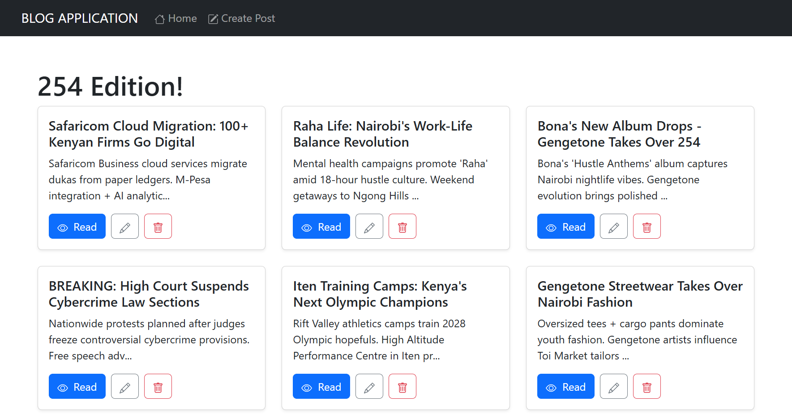
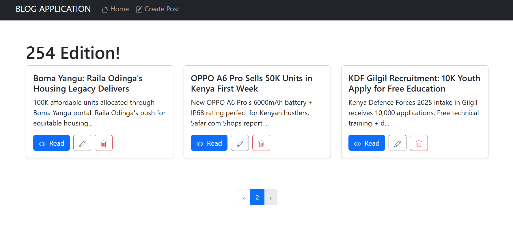
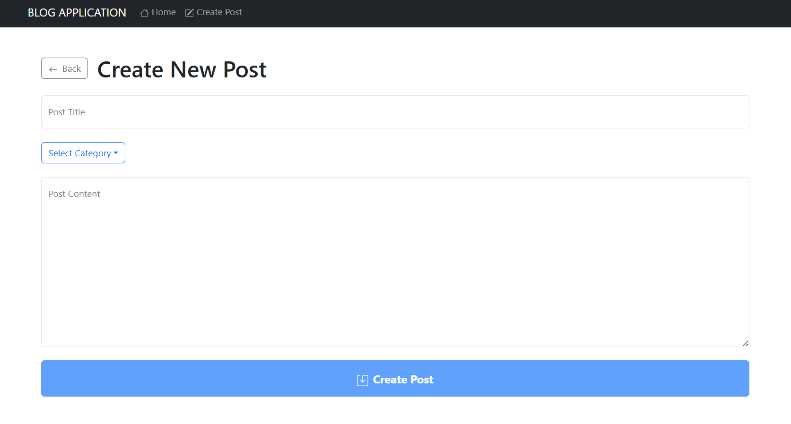
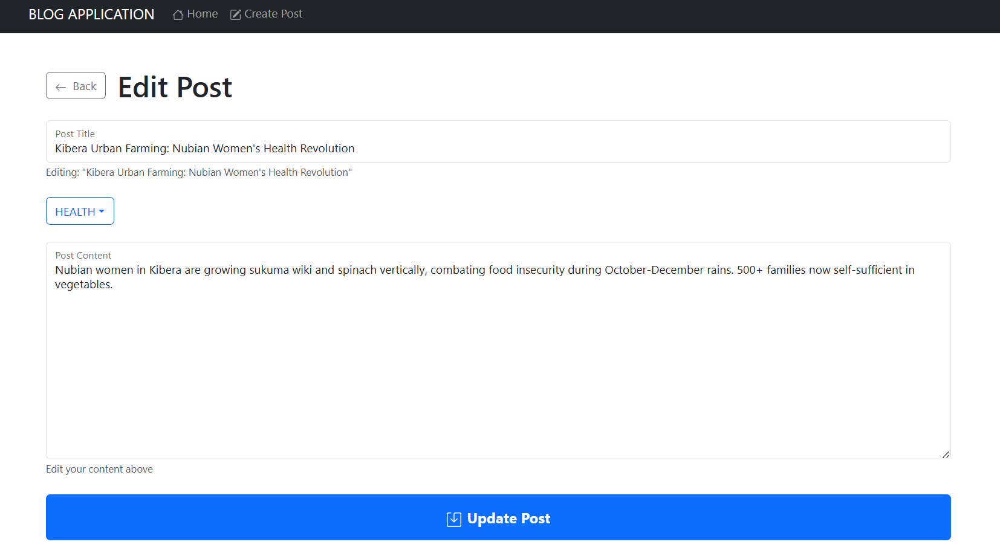
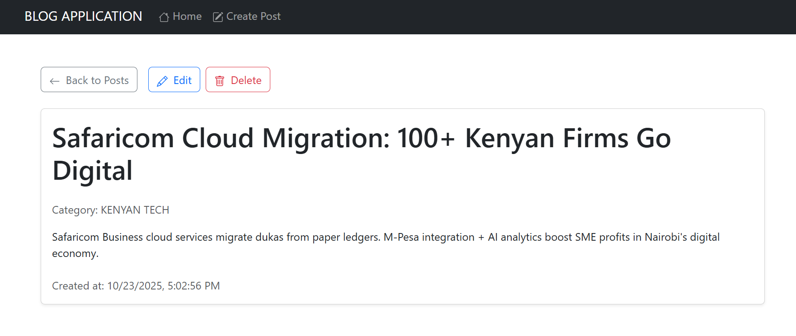
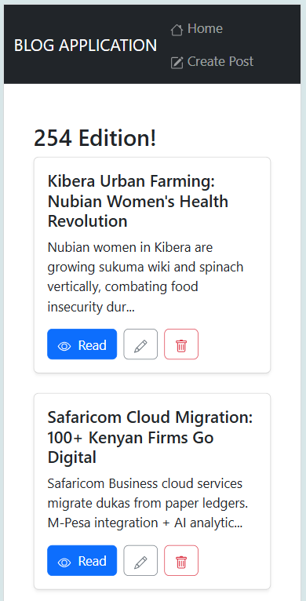

# 🚀 MERN Blog Application - Kenya Edition

## 📱 Overview

Full-stack MERN blog with **254 vibes**. React 18+, Node.js, Express, MongoDB. **Auto-populating edit forms**, **pagination**, **optimistic updates**, **20+ Kenyan categories** with trending posts.

## ✨ Features

- ✅ Full CRUD (Create, Read, Update, Delete)
- ✅ **Pagination** (9 posts/page + page buttons)
- ✅ **Auto-populate Edit** (form fills instantly)
- ✅ 20 Kenyan categories (TECHNOLOGY, M-PESA, HUSTLE CULTURE...)
- ✅ Trending posts (AI startups, Nyama Choma, Cybercrime laws)
- ✅ Form validation (Yup + React Hook Form)
- ✅ Responsive mobile-first UI
- ✅ Optimistic updates + loading states

## 🛠️ Tech Stack

Frontend: React 18+ | React Router | React Hook Form | Yup
Backend: Node.js | Express | Mongoose | MongoDB


## 🚀 Quick Setup

```bash
cd server && cp .env.example .env && npm i && npm run dev
cd ../client && npm i && npm run dev
```


## 📡 API Endpoints

GET  /api/posts?page=1&limit=9     # Paginated posts
GET  /api/posts/:id                # Single post
POST /api/posts                    # Create
PUT  /api/posts/:id                # Update
DELETE /api/posts/:id              # Delete
GET  /api/categories               # Categories


## 🌐 Routes

* / - Home (posts + pagination)
* /create - New post
* /edit/:id - **Edit** (auto-fills)
* /posts/:id - **Read** + Edit/Delete


## 🇰🇪 Sample Data

**Categories:** TECHNOLOGY | M-PESA | HUSTLE CULTURE | KENYAN TECH
**Posts:** "Kenya's Tech Boom" | "M-Pesa 1M Transactions"


## 📱 Screenshots

### HOME



### PAGINATION



### CREATE POST



### EDIT-AUTO-FILLED-POST



### READ POST



### MOBILE VIEW



## 🔧 .env Files

**server/.env:**

MONGO_URI=mongodb://localhost:27017/mern-blog
PORT=5000

client/.env:

VITE_API_URL=http://localhost:5000/api

## 🎯 Live Demo

Frontend: http://localhost:5173
Backend: http://localhost:5000/api

## ⭐ Production ready! 254 Vibes 🇰🇪
